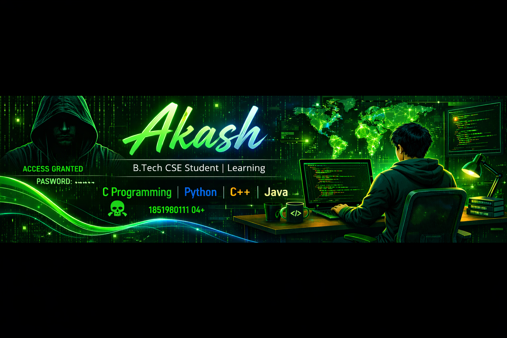
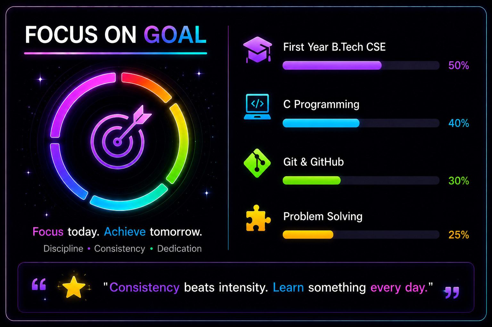

<!-- GitHub Profile Banner -->

  

<h3 align="center">Learning C Programming, Python, C++, Java</h3>

  

---

---
## 📊 GitHub Stats
  

---
## 🚀 About Me

- 🎓 First Year B.Tech CSE Student
- 💻 Learning C Programming
- 🌱 Learning Git & GitHub
- 🧩 Improving Problem Solving
- 🎯 Goal: Become a Software Engineer

---

## 🛠 Skills

- C Programming
- Git & GitHub
- Problem Solving
- HTML
- CSS

---

## 📈 Learning Progress

| Skill | Progress |
|-------|----------|
| 🎓 First Year B.Tech CSE | 50% |
| 💻 C Programming | 40% |
| 🌱 Git & GitHub | 30% |
| 🧩 Problem Solving | 25% |

---
## ✨ Quote

> **"Consistency beats intensity. Learn something every day."**

### 💙 Focus today. Achieve tomorrow.

---

### ⭐ Thanks for visiting my profile!

